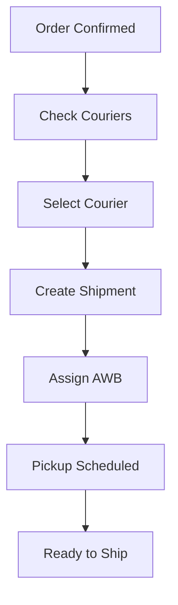

# Shiprocket Integration - Quick Start Guide

## 🚀 Quick Setup (5 minutes)

### Step 1: Database Setup
Copy and run the SQL from `SHIPROCKET_SETUP.sql` in your Supabase SQL Editor.

### Step 2: Configure Credentials
1. Log in as a seller
2. Navigate to `/seller/settings`
3. Click "Shiprocket" tab
4. Enter your Shiprocket email and password
5. Enter your pickup location name (must match Shiprocket account)
6. Click "Save Credentials"

### Step 3: Create Your First Shipment
1. Go to any confirmed order at `/seller/order/:orderId`
2. Click "Check Available Couriers"
3. Select a courier from the list
4. Click "Create Shipment with Selected Courier"
5. Click "Assign AWB & Schedule Pickup"
6. Done! Your shipment is ready for pickup

## 📁 File Structure

```
src/
├── utils/
│   └── shiprocket.ts                    # API client
├── components/
│   └── shiprocket/
│       ├── ShiprocketManager.tsx        # Main workflow component
│       └── ShiprocketSettings.tsx       # Credentials management
└── pages/
    └── seller/
        └── Settings.tsx                 # Settings page

supabase/
└── migrations/
    └── 20251008175101_shiprocket_integration.sql

Documentation:
├── SHIPROCKET_INTEGRATION.md            # Full guide
├── SHIPROCKET_SETUP.sql                 # Database setup
├── IMPLEMENTATION_SUMMARY.md            # Technical details
└── QUICK_START.md                       # This file
```

## 🔑 Key Features

| Feature | Description | Location |
|---------|-------------|----------|
| Credentials Management | Store Shiprocket API credentials | `/seller/settings` |
| Courier Check | View available couriers with pricing | Order detail page |
| Create Shipment | Create order in Shiprocket | Order detail page |
| AWB Assignment | Get tracking number | Order detail page |
| Pickup Scheduling | Auto-schedule with courier | Automatic |

## 🎯 User Flow



## 💻 API Functions

```typescript
// Import
import {
  createShiprocketOrder,
  checkServiceability,
  assignAWB,
  generatePickup,
  trackShipment
} from '../utils/shiprocket';

// Check serviceability
const couriers = await checkServiceability(
  credentials,
  pickupPostcode,
  deliveryPostcode,
  isCOD,
  weight
);

// Create order
const result = await createShiprocketOrder(credentials, orderPayload);

// Assign AWB
const awb = await assignAWB(credentials, shipmentId, courierId);
```

## 🔧 Configuration

### Required Shiprocket Setup:
- Active Shiprocket account
- At least one pickup location configured
- Sufficient wallet balance

### Required Database Tables:
- `shiprocket_credentials`
- `shiprocket_shipments`
- `shiprocket_courier_cache`

### Modified Tables:
- `orders` (adds `shiprocket_order_id`, `shiprocket_shipment_id`)

## 🛡️ Security

- Row Level Security (RLS) enabled on all tables
- Sellers can only access their own data
- Admins have full access
- Credentials stored securely in database

## 🐛 Troubleshooting

| Issue | Solution |
|-------|----------|
| No couriers available | Check if pincode is serviceable |
| Authentication failed | Verify email/password in settings |
| Pickup location error | Match exact name from Shiprocket |
| AWB assignment failed | Check Shiprocket wallet balance |

## 📊 Database Tables

### shiprocket_credentials
Stores API credentials for each seller

### shiprocket_shipments
Stores shipment details and tracking info

### shiprocket_courier_cache
Caches courier serviceability (1-hour TTL)

## 🔗 Routes Added

- `/seller/settings` - Seller settings with Shiprocket configuration

## 📦 Components Usage

### In Order Detail Page
```tsx
import { ShiprocketManager } from '../../components/shiprocket/ShiprocketManager';

<ShiprocketManager
  orderId={order.id}
  order={order}
  onSuccess={(awbCode) => {
    console.log('Shipment created:', awbCode);
  }}
/>
```

### In Settings Page
```tsx
import { ShiprocketSettings } from '../../components/shiprocket/ShiprocketSettings';

<ShiprocketSettings />
```

## 📈 What Gets Stored

When you create a shipment:
1. **shiprocket_credentials** - Your API credentials
2. **shiprocket_shipments** - Shipment details, AWB, courier info
3. **orders** - Updated with Shiprocket IDs
4. **shiprocket_courier_cache** - Cached courier rates (temporary)

## ⚡ Performance

- Token cached for 10 hours
- Courier cache expires after 1 hour
- Minimal API calls through smart caching
- Optimistic UI updates

## 🎓 Learn More

- Full documentation: `SHIPROCKET_INTEGRATION.md`
- Technical details: `IMPLEMENTATION_SUMMARY.md`
- Database setup: `SHIPROCKET_SETUP.sql`
- Shiprocket API Docs: https://apidocs.shiprocket.in/

## ✅ Checklist

Before going live:
- [ ] Database tables created
- [ ] RLS policies active
- [ ] Seller credentials configured
- [ ] Test shipment created successfully
- [ ] AWB assigned and tracking working
- [ ] Order status updating correctly

## 🎉 That's It!

You now have a fully functional Shiprocket integration. Create shipments, assign AWB numbers, and track packages all from your platform.

**Need Help?** Check the troubleshooting section in `SHIPROCKET_INTEGRATION.md`
